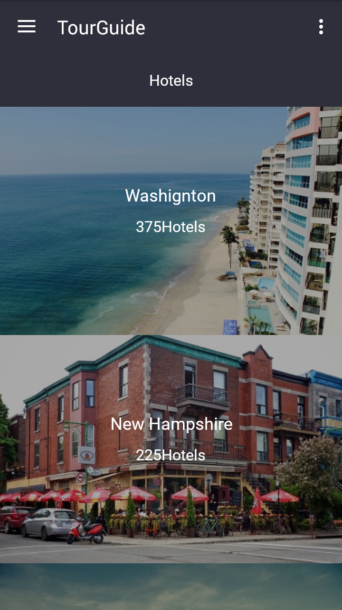
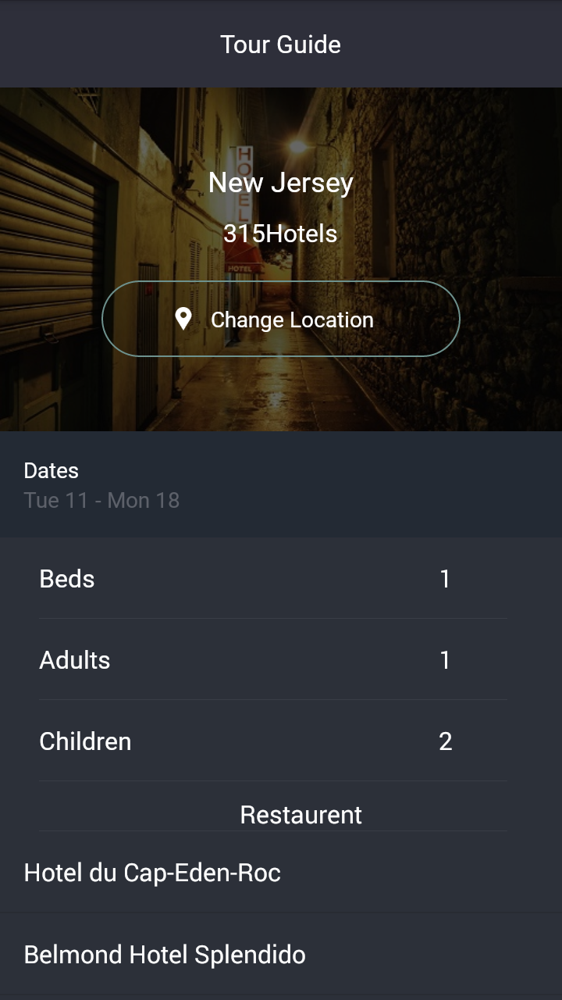
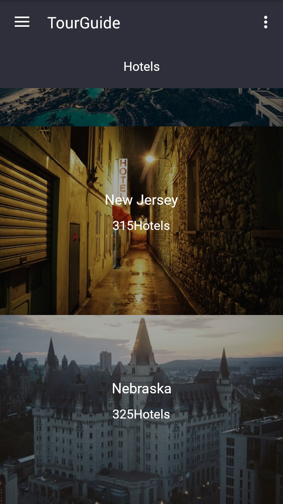
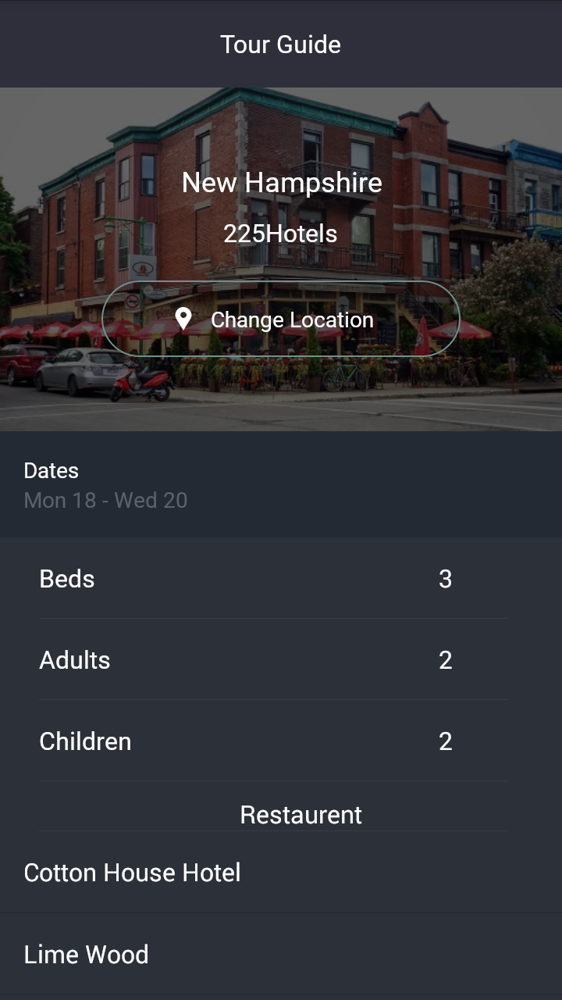

## TourGuideApp
Tour guide app which presents relevant information to a user who’s visiting your city.
Project which comes under Udacity Android Basics Nanodegree Program

## Project Overview
I will be making your own multi-screen Android app to share your knowledge about a city you are very familiar with. The goal is to create a tour guide app which presents relevant information to a user who’s visiting your city. The app can list top attractions, restaurants, public places, or events for the city. It can contain all the best known secrets that only locals know.

## What will I learn?
This project is about combining various ideas and skills we’ve been practicing throughout the course. They include:

1. Planning your app design and navigation before coding.
2. Selecting proper data structures to store lists of information.
3. Building layouts to display those lists of data.
4. Navigating between those lists using intents and multiple Activities or a ViewPager.
5. Creating your own custom classes.
6. Properly handling images or audio (if applicable).

## Final Output - Screenshots

Screen 1                          |Screen 2
:--------------------------------:|:--------------------------------:
  |

Screen 3                          |Screen 4
:--------------------------------:|:--------------------------------:
  |

## Download
You can download the apk here [TourGuideApp](../../raw/master/app/screenshots/app-debug.apk)
